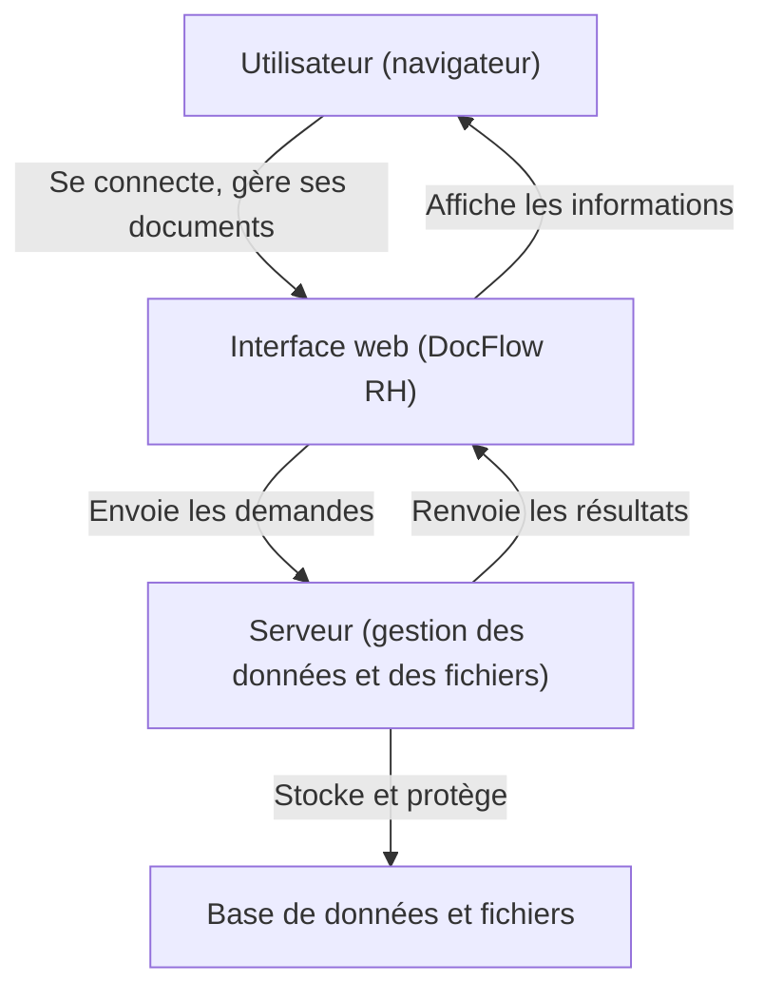

# Projet de Licence RH
# Mise en place d’un système de numérisation de documents dans une entreprise

Application développée par : **[Ton nom]**  
Pour : **[Noms des étudiants, Université, etc.]**  
Date : **[Date de remise]**

---

# Documentation Utilisateur – Application DocFlow RH

---

## 1. Introduction

La gestion documentaire est un enjeu majeur pour les services Ressources Humaines. Ce projet vise à moderniser et sécuriser la gestion des documents RH grâce à une application web simple et efficace, adaptée aux besoins d’une entreprise moderne.

---

## 2. Objectifs du projet

- Faciliter l’archivage, la recherche et le partage des documents RH.
- Réduire l’utilisation du papier et les risques de perte de documents.
- Garantir la confidentialité et la sécurité des informations sensibles.

---

## 3. Fonctionnalités de l’application

- **Connexion sécurisée**  
  

- **Tableau de bord**  
  Vue d’ensemble de l’activité documentaire.  
  

- **Ajout de documents**  
  Import de fichiers PDF, Word, etc.  
  

- **Recherche et filtres**  
  Retrouver rapidement un document.  
  

- **Gestion des utilisateurs** (pour les administrateurs)  
  

- **Téléchargement et suppression de documents**

---

## 4. Guide utilisateur

### a) Connexion

- Rendez-vous sur la page d’accueil.
- Saisissez votre e-mail et mot de passe.
- Cliquez sur « Se connecter ».
- 

### b) Tableau de bord

- Après connexion, accédez au tableau de bord.
- Visualisez le nombre de documents, les derniers ajouts, etc.
- 

### c) Ajouter un document

- Cliquez sur « Nouveau Document ».
- Remplissez le formulaire : titre, description, catégorie, puis sélectionnez le fichier à importer.
- Cliquez sur « Enregistrer ».
- 

**Exemple concret** :
> Vous souhaitez archiver le contrat de travail d’un nouvel employé. Cliquez sur “Nouveau Document”, indiquez “Contrat de travail – Jean Dupont”, sélectionnez le fichier PDF, puis validez. Le document est désormais accessible à tout moment.

### d) Rechercher un document

- Utilisez la barre de recherche ou les filtres par catégorie.
- 

### e) Gérer les utilisateurs (administrateur)

- Accédez à la section « Utilisateurs ».
- Ajoutez, modifiez ou supprimez des comptes.
- 

### f) Télécharger ou supprimer un document

- Dans la liste des documents, cliquez sur l’icône de téléchargement ou de suppression à côté du fichier concerné.

---

## 5. Sécurité et confidentialité

- Les accès sont protégés par mot de passe.
- Les documents sont stockés de façon sécurisée.
- Les rôles (utilisateur/administrateur) limitent les droits d’accès.
- Les mots de passe sont chiffrés.

---

## 6. Schéma de fonctionnement

---

## 7. Annexes

### Glossaire

- **Numérisation** : transformation d’un document papier en fichier numérique.
- **Archivage** : conservation organisée des documents.
- **Utilisateur** : personne ayant accès à l’application.
- **Administrateur** : utilisateur ayant des droits supplémentaires.

### FAQ

- **Que faire si j’ai oublié mon mot de passe ?**  
  Contacter l’administrateur.

- **Qui peut voir mes documents ?**  
  Seuls vous et les administrateurs.

### Contacts

- Pour toute question technique : [Ton e-mail]
- Pour la gestion des comptes : [Contact RH]

---

*Remplace les chemins des captures d’écran par tes propres fichiers si besoin. Mets en forme ce document dans un éditeur Markdown ou convertis-le en PDF/Word selon tes besoins.* 